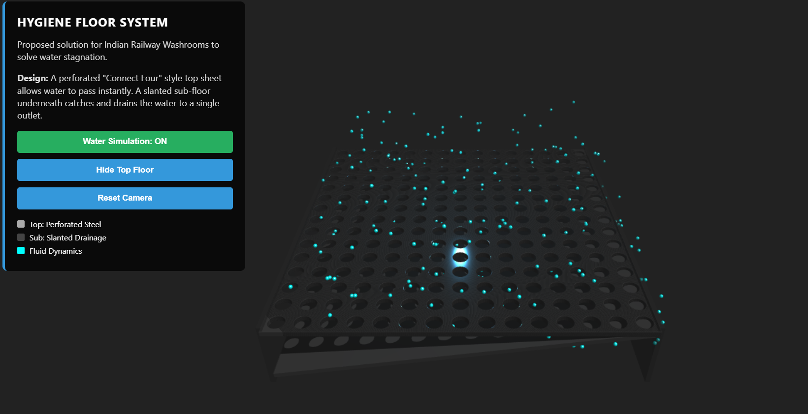
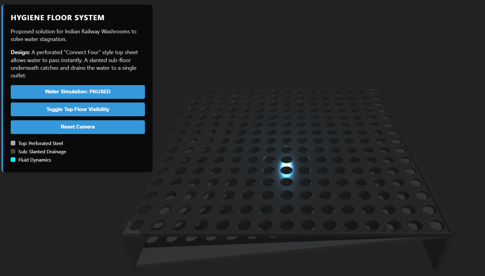
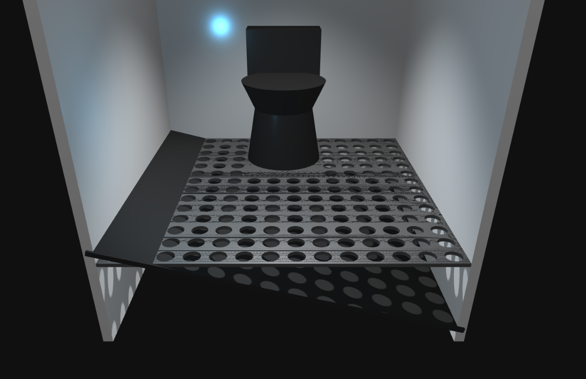

# 🚆 Indian Railway Washroom – A Simple, Honest Innovation

## ✨ The Problem

Engineers today often chase "modern" by copy‑pasting whatever Japan or Europe is doing. Shiny plastics, fancy stickers, bio‑reactors, big words… but **no connection to ground reality**.

India isn’t Europe. We have:

* 1.5+ billion people
* Water‑based cleaning habits
* High footfall
* Humid, wet washrooms
* Almost no drainage engineering inside trains

And the result? **Perpetually wet, slippery, unhygienic washrooms.**

A basic engineering principle:
👉 *“Define the problem, define constraints, then solve.”*
Not: *copy whatever looks modern and hope it works.*

---

## 💡 The Core Issue

People use water. Water spills. Water has nowhere to go.
So the floor stays wet… always.

**99% of the problem is the lack of drainage.**

---

## 🧠 The Solution (So Simple Even a Kid Can Think It)

### 1️⃣ Perforated Floor – Let the Water Go DOWN

A strong metal sheet with evenly spaced holes (2–3 cm).
The moment water touches the surface, it *falls through* instead of spreading around.

**Image:**

---

### 2️⃣ Slanted Collection Tray – Guide the Water OUT

Right below the perforated sheet, add a solid metal sheet at a slight angle.
This collects water and drains it out safely.

Even when the train is moving, air pressure won't push water back up because:

* Upper layer = holes
* Lower layer = fully solid with anti‑backflow angle also good for drainage.

**Image:**

---

## ✨ THE SOLUTION: Dual-Layer Drainage — An Exercise in Basic Ingenuity

This is not my domain — but the sheer level of mediocrity and overcomplicated, copy-paste design in the name of "modern engineering" has made it impossible not to point out an obvious, ground‑truth solution. When basic principles are ignored for shiny brochures, someone has to say it plainly.

This dual‑layer floor embraces the simple reality: **people use water**. Instead of fighting it with complex, failure-prone systems, we let gravity do the work.

| Component                                    | Material (Example)                           | Function                                                                                                                                                  |
| -------------------------------------------- | -------------------------------------------- | --------------------------------------------------------------------------------------------------------------------------------------------------------- |
| **Layer 1: The Dry Surface (Top)**           | Perforated Stainless Steel or Composite      | Acts as a simple, effective sieve. Users stand on this. **Water passes through instantly**, leaving the top surface dry. Wallah.                          |
| **Layer 2: The Collection Tray (Sub-floor)** | Sealed, Slanted Corrosion-Resistant Material | Catches 100% of the trickled water. Engineered with a non-negotiable slope to channel liquid toward a single sealed exit, preventing backflow or leakage. |

## 🚽 The Final Experience – A Dry, Clean Washroom

No humidity.
No puddles.
No everlasting stink.
Just **basic engineering done right**.

**Image:**

---

## 🔥 Why This Matters

Innovation is not about flashy tech or importing European designs.
Real innovation is:

* looking at the actual problem,
* understanding local constraints,
* and solving it elegantly.

India doesn’t need complicated bio‑reactors or million‑rupee toilets.
It needs **sanity**, **clarity**, and **basic engineering courage**.

---

## 🛠️ This Repository Includes

* A lightweight **3D static webpage** demonstrating the floor design 
* Visual explanation images
* A simple, scalable, India‑ready concept

---

## 🧭 Philosophy Behind This

If we must copy something from Japan, copy:

* **Kaizen** – continuous improvement
* **Wabi‑Sabi** – embrace imperfections and make things work better

Not shiny plastics.
Not overpriced bio‑units.
Not fake “modernity.”

---

## 🌱 A Call for Real Engineering

Engineers shouldn’t be showrooms for European designs.
Engineers should **observe, question, and innovate for their own people**.

This project is a reminder:

> Sometimes the solution is so simple, it feels embarrassing that it wasn’t done already.

